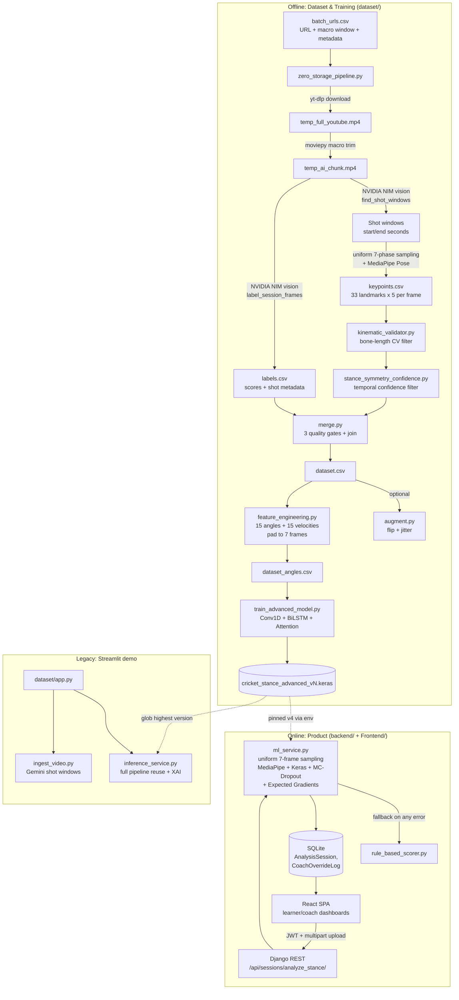

# PROJECT_UNDERSTANDING.md

**Date:** 2026-07-20
**Scope:** Full-repository read-through (no code was modified). Companion documents: [PROJECT_AUDIT.md](PROJECT_AUDIT.md), [STABILIZATION_PLAN.md](STABILIZATION_PLAN.md).

---

## 1. Overall Purpose

The **Cricket Stance Analyzer** ("SuhasVision") is a full-stack AI system that evaluates a cricket batsman's technique from video. It produces four 0–100 scores — **Balance, Power, Technique, Defence** — plus a per-score uncertainty estimate (MC-Dropout), an explanation of which joints drove the weakest score (Expected Gradients attribution), and a recommended drill.

The project is really **two systems sharing one ML core**:

1. **An offline research/data pipeline** (`dataset/`) that builds a labeled training dataset from YouTube cricket footage with *zero local video storage*, trains the scoring model, and evaluates it with academically rigorous protocols (identity-grouped cross-validation, ablations, significance tests). This is the pipeline the prompt calls the **Shot Extraction Pipeline**.
2. **An online product** — a Django REST backend (`backend/`) + React frontend (`Frontend/`) — where **learners** upload a clip and get scored, and **coaches** review sessions, override AI scores (logged for traceability), and manage academy players.

There is also a **legacy Streamlit demo path** (`dataset/app.py`, root `live_demo.py`) predating the Django product, still present and partially divergent.

The original SRS (v1, `srs_extracted.txt`) described a Claude-Vision + FastAPI + ffmpeg.wasm design; the implemented system is entirely different (Django + MediaPipe + NVIDIA NIM + custom Keras model). The current source of truth for design intent is `docs/SuhasVision_V2_Architecture_Specification.docx` (the "frozen V2 spec" the recent milestones reference) and, for what is *actually verified true*, `docs/architecture_ground_truth.md`.

---

## 2. System Architecture



Key architectural facts (confirmed in `docs/architecture_ground_truth.md` against the actual `.keras` artifacts):

- **Model:** `Input(7,30) → Conv1D(64,k=3) → BatchNorm → Dropout(0.2) → BiLSTM(64) → Dropout(0.3) → TemporalAttention → Dense(32) → Dense(4, sigmoid)`. 76,395 trainable parameters. Training script and deployed artifact are in sync.
- **Features:** 15 biomechanical joint angles (normalized /180) + their 15 frame-to-frame velocities = 30 features per frame, 7 frames per session. Single source of truth: `dataset/schema.py`.
- **Shared layers:** `TemporalAttention` lives once in `dataset/model_layers.py` (Milestone 1 consolidation; two stragglers remain — see audit).
- **Deployment pinning:** the Django backend pins `cricket_stance_advanced_v5.keras` via `CRICKET_MODEL_FILENAME` (promoted 2026-07-20 after a direct, methodology-matched comparison and live-path validation against v4 — see `docs/SuhasVision_SRS_v2.0.docx` §9); the Streamlit path auto-selects the highest `v*.keras` on disk, which now agrees.

---

## 3. Data Flow (End to End)

### 3.1 Dataset construction ("zero-storage" ingestion)

Per row of `batch_urls.csv` (`url, batsman_name, angle, macro_start_sec, macro_end_sec, bowling_type`), `zero_storage_pipeline.run_zero_storage_pipeline()`:

1. **Download** best-video-only ≤720p MP4 via yt-dlp (cookie fallback chain for bot detection; stale `.part` files purged first — a hard-won fix documented in-code).
2. **Macro-trim** to the human-provided window with moviepy; delete the full video immediately.
3. **AI shot detection** — `nvidia_client.find_shot_windows()` samples ≤10 evenly-spaced frames from the chunk, sends them to NVIDIA NIM's vision model (`nemotron-3-nano-omni-30b`), and asks for *frame-index ranges* bounding every distinct batting sequence. Timestamp math stays local; the model only picks indices. Returns a list of `{start_time, end_time}` windows on the chunk's own timeline.
4. **7-phase frame sampling** — `extract_keypoints_in_memory()` linearly interpolates 7 frame indices across each shot window, one per canonical phase: *stance, trigger, backlift_start, full_backlift, downswing, contact, follow-through*. (A wrist-speed-guided adaptive sampler, Milestone 4, exists but is **disabled by default** after review proved it can lock onto the wrong person — see §10/audit.)
5. **Pose extraction & validation** — `extract_features_from_image_array()` runs MediaPipe PoseLandmarker (heavy, 33 landmarks × {x,y,z,visibility,presence}) per frame, then:
   - `validate_pose()` — per-phase topology checks (ankle below knee below hip for stance/trigger; loose bounds mid-swing). Low-visibility joints are *logged but not rejected* (occluded far-side limbs are normal in profile sports).
   - `apply_pipeline_rules()` — session-level triage: hard-reject on 3 consecutive missing frames or ≥4 missing total; otherwise reconstruct gaps (linear interpolation for interior 1–2-frame gaps, linear extrapolation for edge frames). Interpolated phases are recorded in an `interpolated_frames` CSV column.
6. **Persist** the 7 × 167-value rows to `keypoints.csv` (header schema is verified on every run — appending to a stale-schema file fails loudly).
7. **AI labelling** — `label_session_frames()` sends the same 7 in-memory frames to NVIDIA NIM with a coach-persona prompt; returns shot type, handedness, skill level, strength/weakness/drill text, and the four scores → `labels.csv`. Missing/malformed scores now cause the row to be *skipped*, never defaulted (the old default-to-50 behavior fabricated 90 real rows — fixed).
8. All temp video is deleted; rejections and notable events append to `pipeline_rejections.log`. A 402 from NVIDIA raises `CreditsExhaustedError` and halts the whole batch cleanly.

### 3.2 Quality gates and feature engineering

- `kinematic_validator.py` — flags frames where **bone lengths** (12 bones) vary implausibly across the session (CV > 0.25) or left/right symmetry deviates > 35%. Writes `kinematic_valid` boolean; never deletes.
- `stance_symmetry_confidence.py` (Milestone 3) — continuous per-frame `temporal_confidence ∈ (0,1]` combining trajectory-smoothness (normalized jerk of the same 12 joints, scaled by each joint's own path length) and a stance-phase bilateral-symmetry prior (z-scored against empirically fit reference stats). Sessions with duplicated `frame_name`s get NaN (they can't be scored trustworthily). Runs after the kinematic validator, on the same `keypoints_validated.csv`.
- `merge.py` — the single choke point: drops `kinematic_valid == False` frames, drops `temporal_confidence < 0.5` (and NaN), drops label rows with the all-four-scores-exactly-50 failure signature, dedupes labels, inner-joins keypoints × labels → `dataset.csv`.
- `feature_engineering.py` — computes the 15 angles (3D vector math, `arccos` with a 1e-6 epsilon that is *deliberately identical* to the serving-side implementations), normalizes /180, **pads every session to exactly 7 canonical frames** (`reindex` + `ffill`/`bfill` after `normalize_frame_name()` — the normalization fix that recovered 42% of the dataset from silent NaN corruption), then computes per-session frame-diff velocities → `dataset_angles.csv`.
- `augment.py` — horizontal flip (with left/right column swap and `batting_hand` relabel) + Gaussian keypoint jitter (σ=0.005). Applied only to non-augmented base rows, so it is idempotent. **Note:** its output file is only consumed when explicitly passed via `--input` to downstream scripts; the default lineage does not include it.

### 3.3 Training & evaluation

- `train_advanced_model.py` — builds (7,30) sequences per session, fixes annotation typos (scores > 100 divided by 10), scales to [0,1], **identity-grouped** 80/20 split (`extract_batsman_name` groups flip/jitter clones with their original), shot-type class weighting on the training split only, early stopping. Reports train and held-out MAE separately.
- `evaluation_protocol.py` (Milestone 2) — the shared methodology module: `GroupKFold`/`LeaveOneGroupOut` fold construction, explicit leakage assertions, MAE + Spearman/Kendall, constant-mean baseline, Wilcoxon paired significance test, skill/shot-type breakdowns. Used by `cross_validate.py`, `ablation_study.py`, `evaluate_baselines.py`, `ablation_stance_symmetry_filter.py`.
- **Current headline numbers** (`dataset/EVALUATION_RESULTS.md`, post-data-bug-fix, 130 sessions / 42 identities, front-view, fast bowling): 5-fold grouped CV **overall MAE 11.56 ± 1.76**, beating the constant-mean baseline (13.59) in all 5 folds (Wilcoxon p=0.0625 — the floor for n=5; honestly reported as not clearing 0.05). MC-Dropout uncertainty is **not** currently calibrated (r=0.02–0.08 vs. real error, n.s.).

### 3.4 Product serving path (Django)

`POST /api/sessions/analyze_stance/` (JWT-authenticated, 200MB/type-checked upload):

1. Video saved to `media/videos/` under a UUID name; **always deleted** in a `finally` (zero-storage requirement holds for the product too).
2. `ml_service.run_advanced_inference()` — samples 7 frames **uniformly across the entire uploaded clip** (no shot detection on this path — see audit), MediaPipe per frame, nearest-neighbor imputation for undetected frames, computes the same 30 features, then:
   - 30 MC-Dropout forward passes → mean scores (×100) + per-score std (`confidence_variance`).
   - Expected Gradients attribution (12 real training-set baselines × 6 path steps, via `tf.GradientTape` — shap's math without shap, because numba's DLL is blocked by this machine's Application Control policy) → top-2 joint drivers of the weakest score + mapped drill texts.
   - On *any* exception: falls back to `rule_based_scorer.score_from_keypoint_df()` (knee-flexion + elbow-extension heuristics; Power/Defence fixed at neutral 50; `is_fallback=True`).
3. Results persist to `AnalysisSession` (scores, variance JSON, attribution JSON, fallback flag). Coach PATCHes to the four score fields are diffed and journaled to `CoachOverrideLog`.

### 3.5 Active-learning loop (partially wired)

`active_learning_retrain.py` merges coach-corrected scores with logged inference tensors (`anonymized_inference_tensors.csv`, written by the *Streamlit* path) into the master dataset and retrains to a new version; `inference_service.reload_model()` hot-swaps. **The Django path logs overrides to the database, not to the `coach_overrides.csv` this script reads — the loop is only closed for the legacy Streamlit path** (see audit).

---

## 4. The Shot Extraction Pipeline (Priority Deep-Dive)

"Shot extraction" happens at three temporal granularities, each narrowing the previous:

| Stage | Who does it | Precision | Where |
|---|---|---|---|
| Macro window | Human, in `batch_urls.csv` | ~15–30 s | `zero_storage_pipeline.process_single_row` |
| Shot window | NVIDIA NIM vision on ≤10 sampled frames | window ÷ 9 (e.g. 30 s → ~3.3 s per sample step) | `nvidia_client.find_shot_windows` |
| 7 phase frames | Deterministic linear index formula | exact frames | `extract_keypoints_in_memory` |

**Design strengths:**
- Provider-independent timestamp math (the LLM only picks frame indices; all seconds↔frames arithmetic is local) — deliberately avoids LLM video-timestamp hallucination.
- Bounded prompt cost (≤10 images regardless of window length; NVIDIA hard-caps at 12).
- Degenerate-window handling (single-index "windows" are nudged, bounds-clamped — a past crash class, now fixed).
- A three-layer validation stack behind it (topology → interpolation triage → bone-length CV → temporal confidence) that demonstrably catches real garbage, with per-category rejection logging.
- End-to-end honesty about the *known open defect*: with `num_poses=1`, MediaPipe tracks *one* person with no guarantee it's the batsman. On real nets footage the pipeline was proven (landmark overlays, 4 review rounds) to track the ball feeder in 3/3 AI-detected shots, and only 2 of 3 such sessions were accidentally caught downstream by the bone-CV filter. This is the single biggest data-quality risk in the system and is currently **documented, not fixed** (Milestone 4's adaptive sampling was disabled rather than shipped on top of it).

**Known weaknesses** (full detail + severities in the audit): wrong-person tracking; coarse shot-window resolution for long macro windows; uniform phase sampling assumes constant swing speed (the fix exists but is validly gated off); silent phase misalignment if a frame read fails; no ingestion dedup across re-runs; the *serving* path shares none of the shot-windowing or validation.

---

## 5. AI/ML Models Used and Why

| Model | Role | Why this one |
|---|---|---|
| **MediaPipe PoseLandmarker (heavy, float16)** | 33-landmark 3D pose per frame | Local, free, no GPU required, robust single-person pose; the heavy variant favors accuracy over speed since throughput is 7 frames/session, not video-rate. Auto-downloads if absent. |
| **NVIDIA NIM `nemotron-3-nano-omni-30b`** (OpenAI-compatible endpoint) | (a) shot-window detection, (b) coach-style labelling/scoring | Free-tier hosted vision model; replaced Gemini (deleted `gemini_scorer.py`) and earlier Ollama experiments. Multi-image reasoning is used instead of native video understanding because it's the reliable capability tier. One env var swaps the model. |
| **Conv1D + BiLSTM + TemporalAttention + Dense (76,395 params, Keras)** | 4-score regression from (7,30) sequences | Conv1D captures local temporal jerks; BiLSTM captures phase ordering both directions; additive attention weighs phases (contact matters more than stance for Power). It is the *ablation-winning* architecture of four candidates on real held-out data — the first evidenced architecture claim in the project. Small on purpose: ~130-session dataset cannot support more capacity. |
| **MC-Dropout (30 passes)** | Per-score uncertainty | Cheap Bayesian approximation with zero architecture change. Currently *not* calibrated against real error — reported honestly. |
| **Expected Gradients (hand-rolled, GradientTape)** | Feature attribution → joint drivers → drills | The same math as `shap.GradientExplainer`, implemented directly because numba (shap dependency) is blocked by a Windows Application Control policy on this machine. Real training-set baselines make it stabler than plain saliency. |
| **Rule-based scorer** | Serving fallback (SRS FR-ERR-001) | Deterministic knee/elbow-angle heuristics so a user always gets *something*; deliberately reports neutral 50s for metrics its two rules can't justify, flagged `is_fallback`. |

---

## 6. Folder-by-Folder Explanation

```
Cricket-Stance-Analyzer/
├── backend/                  Django project (the product API)
│   └── backend/
│       ├── backend/          settings.py, urls.py, wsgi/asgi
│       └── api/              models, views, serializers, auth, ml_service
├── Frontend/                 React 18 + Vite + TanStack Router/Query + shadcn/ui + Tailwind
│   └── src/
│       ├── routes/           index (login/register), learner, coach dashboards
│       ├── components/       AppShell + ~50 shadcn ui primitives (jsx AND tsx duplicates)
│       └── lib/api.js        fetch wrapper with JWT header + 401 auto-logout
├── dataset/                  ML heart: ingestion, validation, training, legacy demo
│   ├── academic_scripts/     training, CV, ablations, eval protocol, milestone filters
│   ├── _archive/             retired Gemini/YouTube-trimmer scripts (correctly archived)
│   ├── *.csv                 generated data (gitignored) + several .bak_ snapshots
│   └── *.keras               model artifacts v1/v2/v4/v5 (gitignored)
├── docs/                     SRS v2 docx, V2 architecture spec docx, architecture_ground_truth.md
├── pose_landmarker_heavy.task  30MB MediaPipe model at repo root
├── live_demo.py              legacy Streamlit demo (own TemporalAttention copy)
├── requirements.txt          single pinned env for backend + dataset scripts
└── start_app.bat             starts Django + Vite (stale Ollama mention)
```

## 7. File-by-File Responsibility (High Level)

### dataset/ — pipeline core
| File | Responsibility |
|---|---|
| `zero_storage_pipeline.py` | **The shot extraction pipeline.** Batch ingestion: download → trim → NVIDIA windows → 7-phase MediaPipe extraction → validation/interpolation → keypoints.csv + labels.csv. Also hosts `extract_features_from_image_array` (shared with serving-adjacent paths), `validate_pose`, `apply_pipeline_rules`, and the disabled wrist-speed sampler. |
| `nvidia_client.py` | All NVIDIA NIM calls: `find_shot_windows`, `label_session_frames`, retry/rate-limit/402 handling, no-score-guessing labelling. |
| `schema.py` | Single source of truth: 15 base feature names (immutable tuple), `SEQ_LEN=7`, `EXPECTED_FEATURES` (30). Deliberately TF-free. |
| `model_layers.py` | Single source of truth for `TemporalAttention`. |
| `merge.py` | The quality-gate choke point + keypoints×labels join → dataset.csv. |
| `augment.py` | Flip + jitter augmentation (idempotent, base rows only). |
| `inference_service.py` | Legacy/Streamlit serving: model auto-select + hot reload, tensor extraction reusing the *real* pipeline validation, MC-Dropout scoring, saliency XAI, tensor logging for active learning, annotated-video renderer. |
| `active_learning_retrain.py` | Coach-override → retrain loop (Streamlit-era file contract). |
| `rule_based_scorer.py` | Heuristic scorer: serving fallback + batch CSV scorer. |
| `kinematic_validator.py` | Bone-length CV / symmetry plausibility filter. |
| `ingest_video.py` | **Legacy Gemini** shot-window detection; still imported by `app.py`. |
| `app.py` | Streamlit demo UI (upload → window → score → XAI → coach override CSV). |
| `extract_keypoints.py`, `filter_frontview.py`, `check_frame_yield.py`, `analyze_rejections.py`, `extract_summaries.py`, `labelling_tool.py`, `verify_architecture_diff.py` | Utility/one-off scripts (frames-dir era extraction, view filtering, yield/rejection analysis, manual labelling, artifact diffing). |
| `test_pipeline_logic.py`, `test_zero_storage_pipeline.py`, `test_model_layers.py`, `test_phase2.py` | Unit tests: interpolation triage rules, wrist-speed sampler (incl. the disabled-flag regression guard), schema/layer consolidation, active-learning plumbing. |

### dataset/academic_scripts/ — training & evidence
| File | Responsibility |
|---|---|
| `train_advanced_model.py` | Trains the production architecture with identity-grouped validation. |
| `evaluation_protocol.py` | Shared CV methodology (folds, leakage asserts, metrics, baseline, significance). |
| `cross_validate.py`, `ablation_study.py`, `evaluate_baselines.py` | Grouped CV, 4-architecture ablation, classical baselines. |
| `feature_engineering.py` | 15 angles + velocities + canonical-frame padding (incl. `normalize_frame_name`). |
| `stance_symmetry_confidence.py` + `ablation_stance_symmetry_filter.py` (+ tests) | Milestone 3 filter and its paired-fold ablation. |
| `mc_dropout_inference.py` | MC-Dropout predict + uncertainty-error correlation. |
| `kinematic_validator.py` consumers, `eval_*.py`, `learning_curve.py`, `shuffle_*.py`, `discriminability_analysis.py`, `multiview_validation.py`, `dataset_diversity_report.py`, `agreement_calculator.py`, `visualize_attention.py`, `prove_15_45.py`, `verify_day3.py` | Research/evidence scripts for the academic write-up. |
| `train_lstm_model.py` | Superseded v1 trainer (kept for history). |

### backend/backend/api/
| File | Responsibility |
|---|---|
| `models.py` | `Academy` (coach), `PlayerProfile`, `AnalysisSession` (scores + variance + attribution JSON), `CoachOverrideLog`. |
| `views.py` | Session ViewSet (list scoped by role, direct create blocked, override journaling), `analyze_stance` upload endpoint, learner/coach dashboard aggregates. |
| `ml_service.py` | Product inference: model/detector lazy singletons, angle math, MC-Dropout, Expected Gradients, drill mapping, rule-based fallback wiring. |
| `auth_views.py` | Register (role-branched profile creation, JWT issue), `me` endpoint. |
| `serializers.py` | ModelSerializers (`fields='__all__'`). |
| `urls.py` | Router + JWT auth routes. |
| `tests.py` | Consolidation identity tests + deterministic forward-pass regression check (model-file-gated skip). |

### Frontend/src/
| File | Responsibility |
|---|---|
| `routes/index.jsx` | Landing + login/register (role-aware), JWT storage. |
| `routes/learner.jsx` | Learner dashboard: upload, score history charts, badges, session detail. |
| `routes/coach.jsx` | Coach command center: review queue, player rankings, score override UI. |
| `components/AppShell.jsx` | Role-aware nav shell (real badge counts via props — hardcoded ones were removed). |
| `lib/api.js` | `fetchWithAuth` (Bearer header, FormData-aware, 401 → logout). |

---

## 8. Current Strengths

1. **The recent engineering culture is genuinely strong.** `architecture_ground_truth.md` documents five review rounds that *disproved the project's own claims* with real measurements (landmark overlays, byte-identical output checks, timed disable verification) and shipped a disabled feature rather than a broken one. That honesty is rare and is itself interview-worthy material.
2. **Single-source-of-truth consolidation is done where it matters most** — schema, attention layer, evaluation methodology — each with identity tests (`assertIs`) preventing silent re-divergence.
3. **Evaluation rigor:** identity-grouped folds with leakage assertions, constant-mean baselines, paired significance tests, honest p-value reporting, and a documented history of *which numbers are superseded and why*.
4. **Real, layered data-quality defense:** topology validation → interpolation triage with hard-reject rules → bone-length CV → temporal confidence, all logging rejections by category, all gated at one choke point (`merge.py`).
5. **Defensive file-format handling** learned from real incidents: CSV header verification before append, `.part`-file purging, degenerate-window clamping, corrupt-model skip-and-continue loading.
6. **Zero-storage discipline** holds on both pipelines (temp video always deleted, uploads deleted in `finally`).
7. **Explainability and uncertainty are real math**, not decoration: Expected Gradients with training-set baselines, MC-Dropout std persisted per session, and the uncertainty's *lack* of calibration is measured and admitted.
8. **Failure modes degrade gracefully:** rule-based fallback (flagged, conservative), NVIDIA credit exhaustion halts the batch losslessly, label failures skip rather than fabricate.

## 9. Current Weaknesses

(Severity-classified detail in [PROJECT_AUDIT.md](PROJECT_AUDIT.md); summary here.)

1. **Wrong-person tracking** in pose extraction (`num_poses=1`) — confirmed to corrupt real sessions; only accidentally/partially caught downstream. Affects dataset *and* product uploads.
2. **Train/serve skew:** the Django serving path does *no* shot detection and *none* of the pipeline's validation/interpolation — it uniformly samples the whole upload, imputes by copying neighbor frames, and feeds the model inputs from a different distribution than it was trained on.
3. **Crash-class bugs:** `predict_scores` returns a 3-tuple on failure where callers unpack 4; a failed `cap.read()` silently shifts phase alignment (and can IndexError in the triage rules).
4. **Ingestion is not idempotent:** re-running a batch appends duplicate sessions to `keypoints.csv` (this already caused the 42-duplicate-session incident).
5. **The active-learning loop is severed** for the Django product (DB log vs. CSV contract mismatch).
6. **Two divergent serving stacks** (Django `ml_service` vs. Streamlit `inference_service`) and a third AI provider path (Gemini) still live.
7. **Concurrency-unsafe lazy model init**, synchronous multi-second inference inside the HTTP request, and per-call PoseLandmarker construction.
8. Assorted API-hardening gaps (password validation bypass, `fields='__all__'` on updates, client-supplied PK `get_or_create`, no pagination/throttling).

## 10. Technical Debt

- Duplicated angle-computation blocks (3×), landmark-name lists (4×), and two straggler `TemporalAttention` copies (`live_demo.py`, `visualize_attention.py`).
- Legacy stack remnants: Gemini `ingest_video.py` (+ its hard `GEMINI_API_KEY` requirement crashing `app.py` without it), Ollama mention in `start_app.bat`, Gemini deps still pinned in requirements, superseded `train_lstm_model.py`, frames-dir-era `extract_keypoints.py`.
- Data-lineage sprawl: ~10 generated CSV variants + timestamped `.bak` files with no manifest; augmented datasets enter training only via manual CLI args.
- Frontend ships both `.jsx` and `.tsx` copies of every shadcn primitive; commented-out `useAuth` imports.
- Root-level scratch files (`test_eval.py`, `test_tensor.py`, `evaluate_variance.py`, extracted-text dumps); 30MB model + 3.5MB PDF committed to git.
- Print-based logging throughout the dataset pipeline; no Django `LOGGING` config.
- `frame_name` conventions: normalized at read-time now, but `inference_service` still *writes* the old `frame_01_stance.jpg` convention into the active-learning tensor log.

## 11. Assumptions Made by the System

1. **Exactly one person — the batsman — is in frame** (the confirmed-false assumption behind the wrong-person defect).
2. Every shot fits a **fixed 7-phase template** in order; uniform temporal spacing approximates phase timing well enough (contact ≈ 5/6 of the window).
3. MediaPipe's 3D z-estimates are usable after bone-consistency filtering, on monocular YouTube footage.
4. The NVIDIA vision model's coach-persona scores are ground truth good enough to train on (inter-rater agreement vs. humans has an `agreement_calculator.py` but the labels are single-model).
5. Human-entered macro windows are tight (15–30 s) — window precision degrades linearly with length.
6. `session_name`'s first underscore-token identifies the batsman (identity grouping for CV).
7. Angles + velocities (not raw coordinates) are a sufficient, view-robust representation; front-view footage is the target geometry.
8. Uploads to the product are short, single-shot clips (the uniform-sampling serving path only makes sense under this).
9. One shared virtualenv/requirements serves Django, training, and research alike, on this one Windows machine (numba/Application Control, cv2 flakiness).

## 12. Risks

- **Data poisoning by wrong-person sessions** already in `keypoints.csv` — extent unquantified (checked against one clip style only).
- **Label quality ceiling:** the model regresses onto one LLM's opinions; MAE ~11.5 vs. baseline 13.6 leaves modest learned signal, and Spearman ρ ≈ 0.14–0.28 is weak.
- **Sample size:** 130 sessions / 42 identities; every conclusion (including the ablation win) sits on wide fold-variance. Milestone 3's own ablation is explicitly underpowered.
- **External dependencies:** NVIDIA free tier (credits, model retirement), YouTube bot detection (cookie fragility), MediaPipe model URL availability.
- **Environment fragility:** Application Control DLL blocks (numba, intermittent cv2), OneDrive-synced working tree (file locking/latency on CSV appends), everything keyed to one machine.
- **Security posture** adequate for a demo, not production: SQLite, JWT in localStorage, no rate limiting, permissive update serializers.

## 13. Scalability Concerns

- `analyze_stance` runs ~100+ model passes (30 MC + 72 EG) synchronously per request in the web worker — a few concurrent uploads exhaust the dev server. No queue/worker split, despite the `status` field anticipating one.
- Dataset pipeline is single-threaded, one video at a time with fixed sleeps; fine at 100s of videos, painful at 10,000s.
- Whole-table dashboard queries (`sessions` unpaginated, serialized in full) grow linearly with academy history.
- SQLite write concurrency; CSV-append datastores (keypoints/labels) have no locking and O(file) header checks.
- Repeated `cap.set(CAP_PROP_POS_FRAMES)` seeks per frame are the slow path on long videos (and imprecise on some codecs).

## 14. Maintainability Concerns

- The Django/Streamlit split means every inference improvement must land twice (and currently doesn't — the paths already disagree on validation, model selection, and frame naming).
- Import-time side effects in `zero_storage_pipeline.py` (detector construction, model download, CSV creation/validation in the *current working directory*, and a possible `RuntimeError`) make anything that imports it — including `inference_service` and the test suite — cwd-sensitive and slow to import.
- Script behavior depends on being run from `dataset/` (relative paths everywhere).
- Knowledge concentration: the real system truth lives in `architecture_ground_truth.md` + code comments, not in the SRS documents (v1 describes a different product; v2 docx is not diffable in git).
- No CI; tests exist but nothing runs them automatically; the most safety-critical invariants (e.g. the disabled-flag regression guard) depend on someone running `unittest` locally.

---

*Next: [PROJECT_AUDIT.md](PROJECT_AUDIT.md) classifies every issue found, with impact and recommended fixes. No code has been modified.*
