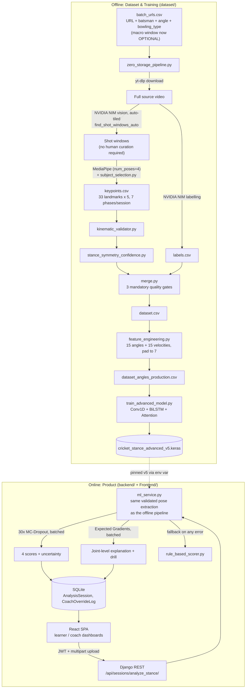
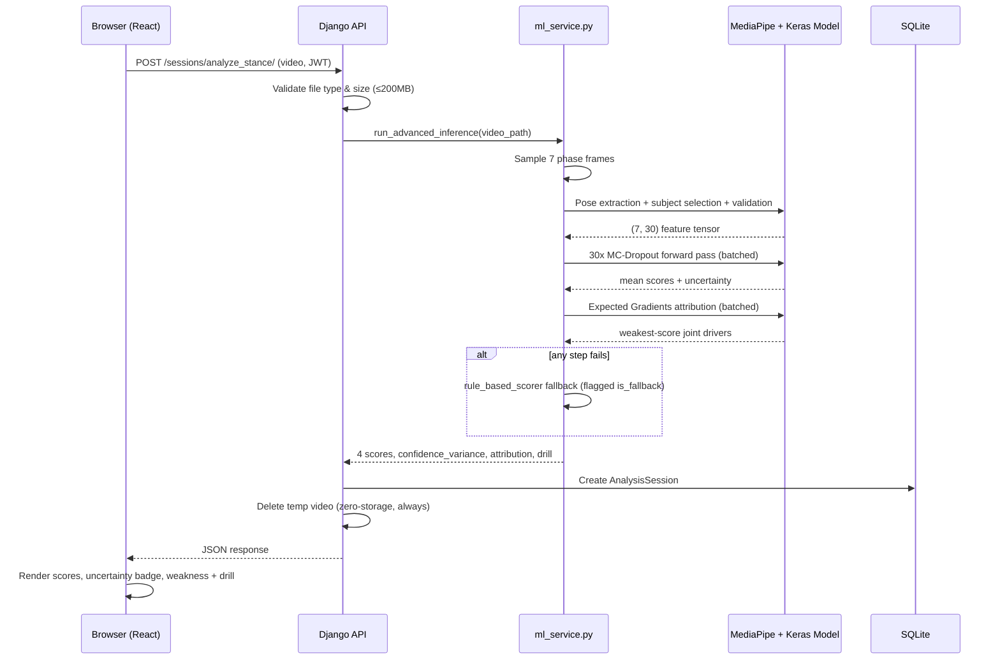

# 🏏 SuhasVision — AI Cricket Batting Stance Analyzer

**Computer vision + deep learning system that scores a batter's technique from a single video clip — Balance, Power, Technique, and Defence, each with a real uncertainty estimate and a per-joint explanation of what's driving the weakest score.**

[](.)
[](.)
[](.)
[](.)
[](.)

> **Suggested GitHub topics:** `computer-vision` `sports-analytics` `cricket` `mediapipe` `tensorflow` `keras` `django` `react` `pose-estimation` `explainable-ai` `bayesian-deep-learning` `action-quality-assessment` `biomechanics` `lstm` `attention-mechanism`

---

## Table of Contents

1. [Problem Statement](#1-problem-statement)
2. [What It Does](#2-what-it-does)
3. [Architecture](#3-architecture)
4. [End-to-End Workflow](#4-end-to-end-workflow)
5. [Data Flow (Offline Pipeline)](#5-data-flow-offline-pipeline)
6. [Model Architecture](#6-model-architecture)
7. [Research Foundations](#7-research-foundations--literature-review)
8. [Results — Current Model Evaluation](#8-results--current-model-evaluation)
9. [Sample Output](#9-sample-output)
10. [Tech Stack](#10-tech-stack)
11. [Getting Started](#11-getting-started)
12. [Data Collection](#12-data-collection)
12b. [Extraction Pipeline — Phase 0–3 Status](#12b-extraction-pipeline--phase-03-status)
13. [Known Limitations](#13-known-limitations)
14. [Future Scope](#14-future-scope)
15. [Project Documentation Index](#15-project-documentation-index)

---

## 1. Problem Statement

A batting coach's real expertise is pattern recognition built from thousands of hours of watching players — they see a stance and, within seconds, know what's wrong with it. That expertise doesn't scale: a single coach can closely watch maybe a dozen players a day. Meanwhile, no large, labelled, cricket-specific stance dataset exists publicly (the closest published comparable, *CricketVision*, uses 8,540 clips this project has no equivalent access to), and the training footage available here is ordinary YouTube/Instagram video — filmed by other people for other reasons, in whatever lighting and framing they happened to use, not a studio.

**SuhasVision's premise:** a meaningful slice of that coaching pattern-recognition — "what does this stance's geometry say" — can be learned from a small, honestly-scoped dataset and delivered instantly from a phone-camera clip, provided every step of the pipeline is built for small-data conditions and every claim about its accuracy is measured, not assumed.

## 2. What It Does

Upload a short video of one batting stroke → the system returns:

- **Four 0–100 scores**: Balance, Power, Technique, Defence
- **A per-score uncertainty estimate** (Monte Carlo Dropout, 30 stochastic passes)
- **An explanation of which specific joints drove the weakest score** (Expected Gradients attribution) and a matched practice drill
- Two role-specific views: a **Learner** dashboard (score history, gamified tiers, coach feedback) and a **Coach** dashboard (review queue, player rankings, score overrides with full audit logging)

## 3. Architecture

Two independent systems share exactly one contract — a trained model file and a fixed 30-feature schema — and nothing else. This separation is deliberate: a bug in the research/training code can never take down the live app, and a change to serve traffic faster can never corrupt training data.



Key facts confirmed against the deployed artifact and current code (not aspirational): 76,395 trainable parameters; the serving path and the training pipeline now run the **same** frame-collection and pose-validation code (no train/serve skew); MC-Dropout and Expected Gradients run as single batched tensor passes (~19× and ~40× faster than the original sequential loops).

## 4. End-to-End Workflow



## 5. Data Flow (Offline Pipeline)

```mermaid
flowchart LR
    A[batch_urls.csv] --> B[zero_storage_pipeline.py]
    B --> C[keypoints.csv]
    B --> D[labels.csv]
    C --> E[kinematic_validator.py]
    E -->|bone-length CV filter| F[keypoints_validated.csv]
    F --> G[stance_symmetry_confidence.py]
    G -->|trajectory + symmetry filter| F
    F --> H[merge.py]
    D --> H
    H -->|3 mandatory gates| I[dataset.csv]
    I --> J[filter_frontview.py] --> K[dataset_frontview.csv]
    K --> L[feature_engineering.py] --> M[dataset_angles_production.csv]
    M --> N[train_advanced_model.py] --> O[(.keras model)]
    M --> P[cross_validate.py] --> Q[EVALUATION_RESULTS.md]
```



Every arrow above is a real, versioned, idempotent script — full producer/consumer detail in [`DATA_LINEAGE.md`](DATA_LINEAGE.md).

## 6. Model Architecture

Input: **(7 timesteps, 30 features)** — 7 canonical phases (stance → follow-through) × 15 joint angles + 15 frame-to-frame angular velocities.

| # | Layer | Output Shape | Params | Purpose |
|---|---|---|---|---|
| 1 | Conv1D(64, k=3, relu) | (7, 64) | 5,824 | Local, short-range temporal patterns across 2-3 adjacent phases |
| 2 | BatchNorm + Dropout(0.2) | (7, 64) | 256 | Stability at small dataset scale |
| 3 | Bidirectional LSTM(64) | (7, 128) | 66,048 | Full-sequence context in both time directions |
| 4 | Dropout(0.3) | (7, 128) | 0 | Regularizes the highest-capacity representation |
| 5 | TemporalAttention (custom, additive) | (128,) | 135 | Learns which phase(s) matter most per score |
| 6 | Dense(32, relu) | (32,) | 4,128 | Shared compressed representation |
| 7 | Dense(4, sigmoid) | (4,) | 132 | Final scores, ×100 for reporting |

**76,395 trainable parameters.** Deliberately small: at ~130 training sessions, a larger network (or full Transformer self-attention in place of the additive attention layer) would have more capacity than the data can constrain — see the research-foundations comparison below for why that specific substitution was rejected.

## 7. Research Foundations — Literature Review

For every major technique used, the paper it comes from, and the real gap in this project it addresses:

| Technique | Paper | Gap it addresses here |
|---|---|---|
| **BlazePose pose estimation** | Bazarevsky et al., *BlazePose: On-device Real-time Body Pose Tracking* (2020) | CPU-only, real-time, pretrained landmark extraction — no bespoke pose-estimation training data needed, and identical at data-collection and serving time (closes a train/serve skew risk) |
| **Monte Carlo Dropout** | Gal & Ghahramani, *Dropout as a Bayesian Approximation* (ICML 2016) | Cheapest route to a per-prediction uncertainty estimate from an already-trained model, zero extra training cost |
| **Expected Gradients** | Erion, Janizek, Sturmfels, Lundberg & Lee, *Improving Performance of Deep Learning Models with Axiomatic Attribution Priors and Expected Gradients* (2021), extending Sundararajan et al.'s *Integrated Gradients* (ICML 2017) | No natural "zero" baseline exists for a joint angle (unlike a black pixel in an image model) — averaging over real training-distribution baselines fixes this. Implemented directly via `tf.GradientTape` rather than the `shap` package, because `shap`'s `numba` dependency is blocked by a Windows Application Control policy on the reference machine — same math, no blocked dependency |
| **Additive (Bahdanau) attention** vs. Transformer self-attention | Bahdanau, Cho & Bengio (ICLR 2015) vs. Vaswani et al., *Attention Is All You Need* (2017) | At 7 timesteps / 42 identities, full self-attention's Q/K/V parameters would add capacity this dataset can't constrain — a deliberate case of matching technique to data scale rather than defaulting to the newest published idea |
| **Temporal Convolutional stem** | Bai, Kolter & Koltun (2018) | A single Conv1D layer (not a full deep TCN — no long sequence here needing dilation) pre-extracts local phase-to-phase patterns before the BiLSTM |
| **Bidirectional LSTM** | Hochreiter & Schmidhuber (1997); Schuster & Paliwal (1997) | The task scores an already-complete sequence offline — no reason to withhold future-phase context from any given phase's representation |
| **Anatomical bone-length consistency filtering** | *This project's own contribution* — no cricket pose-estimation paper in the current literature applies an automated anatomical-consistency filter to monocular 3D extraction | A person's real bone lengths don't change across a session's frames; high frame-to-frame variance in an estimated bone length is itself evidence of a bad pose estimate, requiring no ground truth |
| **Group-aware Contrastive Regression** (identified, not yet implemented) | Yu et al., *CoRe* (ICCV 2021) | Highest-priority forward recommendation — turns N labels into O(N²) training signal from pairwise score-difference regression, directly targeting the small-identity-count bottleneck (§13) |

Full six-question treatment (what/why/alternatives/limitations/would-we-redesign) of every major decision — the shared-detector singleton, reject-over-guess subject selection, idempotent ingestion, train/serve consistency, and more — is in [`docs/SuhasVision_Engineering_Deepdive.docx`](docs/SuhasVision_Engineering_Deepdive.docx).

## 8. Results — Current Model Evaluation

Deployed model: **`cricket_stance_advanced_v5.keras`**, trained on 130 sessions / 42 identities (front-view, fast bowling only).

> ⚠️ **Corrected 2026-07-28.** The previously-published 10.85 MAE came from a
> protocol where early stopping could see the test fold. Under a corrected
> protocol (inner validation split carved from the training fold) the honest
> numbers are below. See [`IMPROVEMENT_ROADMAP.md`](IMPROVEMENT_ROADMAP.md) for
> the full measurement and root-cause analysis.

| Metric | Value (corrected protocol) |
|---|---|
| 5-fold grouped CV, overall MAE | **15.75 ± 3.35** |
| Constant-mean baseline | **13.59 ± 1.44** |
| Wilcoxon vs. baseline | p=0.6250 — **not significant** |
| Mean Spearman ρ *(the AQA-standard metric)* | **+0.145** |
| Previously reported (test-fold-selected) MAE | 10.85 ± 1.95 — **superseded, +39% optimistic** |

**Honest reading: under correct evaluation the model does not currently beat
predicting the mean.** The previously-reported advantage was an artefact of
letting early stopping see the test fold. For context, Pirsiavash et al. (ECCV
2014) achieved SRC 0.41–0.45 with classical pose features on ~150 samples — that
is the bar to clear. [`IMPROVEMENT_ROADMAP.md`](IMPROVEMENT_ROADMAP.md) explains
the route there (label validation first, then more identities, then
pairwise/contrastive regression).

What *is* demonstrated and defensible today: a zero-storage, fully-automated
ingestion pipeline with layered data-quality gates, multi-person subject
selection, train/serve consistency, axiomatically-grounded attribution, and an
evaluation protocol honest enough to catch and report its own inflated numbers.

A real negative result, kept rather than hidden: a flip + Gaussian-jitter data-augmentation strategy was implemented, leak-checked, and evaluated under the identical controlled protocol — it made MAE **6.4% worse** and was **not adopted**. Promotion in this project is a measured decision in both directions, not "ship whatever's newest." (The *why* is now understood: with 129/130 sessions right-handed, horizontal flip generates an out-of-distribution left-handed set carrying labels never validated for it — a label-invariance violation, per Gao et al.'s time-series augmentation survey. See [`IMPROVEMENT_ROADMAP.md`](IMPROVEMENT_ROADMAP.md) §1.)

## 9. Sample Output

```json
{
  "balance_score": 76,
  "power_score": 70,
  "technique_score": 75,
  "defence_score": 73,
  "overall_score": 74,
  "confidence_variance": { "balance": 1.95, "power": 3.11, "technique": 2.29, "defence": 2.17 },
  "primary_weakness": "Power (70/100) is the area to work on — weight transfer and bat speed through contact. Biggest drivers: right knee flexion, left knee flexion.",
  "primary_strength": "Balance (76/100) is the strongest part of this stance — base stability and head position through the shot.",
  "attribution_drivers": ["right knee flexion", "left knee flexion"],
  "recommended_drill": "Split-squat reps to strengthen back-knee drive; Wall-sit knee-bend holds to groove a stable front-knee flex",
  "is_fallback": false
}
```

**Expected output for a well-framed, front-view, single-shot clip:** all four scores populated, `is_fallback: false`, `attribution_drivers` naming two real, session-specific joints (verified to genuinely vary between sessions — not a fixed default). **Expected output for a clip the pipeline can't confidently process** (no trackable single subject, too long/short, unreadable): either an explicit `InvalidUploadError` with a specific user-facing message, or — if pose extraction partially succeeds but full model inference fails — a conservative `is_fallback: true` response from the rule-based scorer rather than a 500 error.

## 10. Tech Stack

| Layer | Technology |
|---|---|
| Pose estimation | MediaPipe BlazePose (PoseLandmarker, "heavy") |
| ML framework | TensorFlow 2.21 / Keras 3.15 |
| Backend | Django 6.0 + Django REST Framework, JWT auth (SimpleJWT) |
| Frontend | React 18 + TanStack Router/Query + Tailwind + shadcn/ui |
| Video sourcing | yt-dlp |
| AI shot detection & labelling | NVIDIA NIM (`nemotron-3-nano-omni`), OpenAI-compatible endpoint |
| Data processing | pandas, numpy, OpenCV |
| Database | SQLite (demo scale; see [Known Limitations](#13-known-limitations)) |

## 11. Getting Started

```bash
# Backend
cd backend/backend
pip install -r ../../requirements.txt
python manage.py migrate
python manage.py runserver 8000

# Frontend (separate terminal)
cd Frontend
npm install
npm run dev

# Dataset pipeline (separate terminal, from dataset/)
python zero_storage_pipeline.py     # requires NVIDIA_API_KEY in dataset/.env
python -m unittest discover         # or run_tests.bat from repo root for everything
```

Environment quirks worth knowing before you hit them: on Windows machines with an Application Control security policy, `numba` (a `shap` dependency, not used here — see §7) and occasionally `cv2` can be blocked; retry the dev server if it fails to start. Keep the working data directory out of an actively-syncing cloud folder if possible — CSV-append + `.bak` churn under continuous sync risks file-lock races.

## 12. Data Collection

Current: 130 sessions / 42 identities, 129 right-handed / 1 left-handed, skill-level skewed toward Amateur/Club (72%) against the project's own 40/30/30 target. Concrete collection targets (by identity count, handedness, skill level), the step-by-step procedure using the new automatic full-video shot scanner (no more manual macro-window timestamping), and expected pipeline attrition rates are all in [`DATA_COLLECTION.md`](DATA_COLLECTION.md).

## 12b. Extraction Pipeline — Phase 0–3 Status

The upstream extraction path (video → correct batsman → correct frames) has been rebuilt and
benchmarked across three phases. **Production still runs the Phase-0 baseline (`A0`)**; the
newer stack is measured but deliberately not promoted. Status is marked per component.

| Component | Status | Evidence |
|---|---|---|
| Uniform 7-frame sampling + MediaPipe subject selection | **IMPLEMENTED (production default, `A0`)** | `extraction_config.py` — `ACTIVE_CONFIG` resolves to A0 |
| Distinct-phase-frame guard (no duplicate frames) | **IMPLEMENTED** | 24 affected clips → 0, test-pinned |
| Diagnostics, benchmark harness, contact sheets | **IMPLEMENTED** | `extraction_*.py`, `phase2_*.py`, `phase3_*.py` |
| YOLO11m@640 person detection | **EXPERIMENTAL** | recall 0.465 → 0.987 (held-out), 4.9× faster |
| ByteTrack multi-object tracking | **EXPERIMENTAL** | batsman-track recall 0.981 |
| Crease-geometry batsman scorer | **EXPERIMENTAL** | wrong-person 0.200 → 0.056 (held-out) |
| Best-7 constrained optimizer (DP) | **EXPERIMENTAL** | `phase3_frame_selection.py`, 26 tests incl. brute-force equivalence |
| Phase-3 temporal ground truth (51 clips) | **IMPLEMENTED** | `phase3_annotations.jsonl` + validation report |
| Motion-energy (MGSampler) sampling | **REJECTED** | no measured benefit, +1.56 s/clip |
| Flip + jitter augmentation | **REJECTED** | MAE +6.4% worse |
| BoT-SORT / ReID tracking | **REJECTED** | no better than ByteTrack, ~19% slower |
| Skeleton-dynamics batsman evidence (S2) | **EXPERIMENTAL** | refusal 0.333 → 0.222, accuracy 0.630 → 0.741 (held-out); +5.1 s/clip |
| Bat / equipment evidence (S3) | **EXPERIMENTAL** | removes the last wrong answer (1 → 0); bat-on-person separation 0.355 vs 0.020 for bat-anywhere |
| Persistence evidence (S1) | **REJECTED** | net −1 clip; contributes variance, not signal |
| Batting-action evidence (S4) | **REJECTED** | wrong-person 0.000 → 0.095; re-breaks the feeder case |
| RTMPose | **PLANNED** | MediaPipe-on-crop works at 81% success; no evidence yet that a switch is justified |
| Phase segmentation, candidate generation, frame-quality scoring | **PLANNED** | Phase 3 continuation |

**Architecture evolution and negative results.** Phase 1 instrumented the pipeline and
*failed* to reduce wrong-person error (29.4% → 26.3%), but diagnosed why: on 70/102 clips
MediaPipe surfaced only one candidate, so subject selection had nothing to choose between.
Phase 2 replaced the detector and confirmed the diagnosis — **100% of the baseline's
wrong-person errors were detection failures**, not selection failures. Tracking alone fixed
nothing; the cricket-geometric prior did. Full detail in
[`PHASE1_EXTRACTION_RESULTS.md`](PHASE1_EXTRACTION_RESULTS.md) and
[`PHASE2_DETECTION_RESULTS.md`](PHASE2_DETECTION_RESULTS.md).

**Phase-3 ground truth (annotation gate).** 51 clips annotated for shot coherence, boundaries
and contact against [`docs/PHASE3_ANNOTATION_PROTOCOL.md`](docs/PHASE3_ANNOTATION_PROTOCOL.md).
Coverage is honest about what the footage supports:

- **28/51** clips yield a cleanly boundable single shot (dev 14 / eval 14)
- **28/51** carry a usable contact frame — only **4** with the ball actually visible (`EXACT`)
- **0/51** carry per-phase spans: at 30 fps, stance/trigger and backlift-start/full-backlift
  are not separable by eye, so **phase-accuracy metrics are not computable** and are not reported
- 23 clips are excluded as multi-shot, scene-cut, whole-session, no-shot or ambiguous

**S0–S4 batsman ablation (51 clips, eval 27).** All arms share identical detections, tracks
and sampled frames; only scoring differs. Wrong-person / refusal on held-out eval:
S0 geometry 0.056 / 0.333 · S1 +persistence 0.059 / 0.370 · S2 +skeleton 0.048 / 0.222 ·
**S3 +equipment 0.000 / 0.259** · S4 +action 0.095 / 0.222. The ladder is **not monotonic** —
persistence and action evidence both hurt. The clearest finding is model-free: "a bat is in
frame" separates batsman from non-batsman tracks by **0.020**, "the bat is on *this* person"
by **0.355**. Detecting a bat is not identifying a batsman. The dominant remaining failure is
**pose extraction on small/occluded batsmen**, not identity. Full detail, including the
stationary-feeder case study where bat evidence points at the *wrong* person, in
[`PHASE3_BATSMAN_ABLATION.md`](PHASE3_BATSMAN_ABLATION.md). Nothing promoted; S2/S3 cost
~5–6 s per clip against 0.3 ms for S0.

**RTMPose evaluation — EXPERIMENTAL, decision made, nothing promoted yet.** The ablation's
closing claim above ("the dominant remaining failure is pose extraction") turned out to be
**partly a measurement artifact, and is corrected here**. `k_pose_rate`, the statistic that
labels a clip a pose failure, counts frames where the batsman *track does not exist*
identically to frames where the pose model ran and failed, so it conflates tracking with
pose. Decomposing it as `coverage × P(pose | box)` over the pipeline's own sampling: of the
10 clips below the 0.4 failure test, **5 are genuinely pose-limited**, 2 are tracking
failures no pose model can reach; of the 7 clips previously *labelled* pose failures only
**3** actually are, while **3 genuine pose failures were never labelled**. A related logic
bug: because `k_pose_rate ≤ coverage` always, `categorise_failure()` tests pose first and its
`"tracking failure"` branch is **unreachable**.

On the comparison itself (51 clips, identical cached tracks/boxes/frames, MediaPipe vs
RTMPose-halpe26): RTMPose's apparent 100% availability is also an artifact — it is a top-down
regressor that **cannot decline**, and returns a full skeleton for a flat grey image. Gated to
MediaPipe's own false-pose rate it keeps only 25.5% of real frames, so it cannot self-verify.
But on person-verified boxes — which is all this pipeline ever gives it — it recovers **27.9%**
of frames MediaPipe drops (**50.8%** on hard clips), wins **every** quality metric on
MediaPipe's own successful frames, and `rtmpose-s` runs **7.2× faster** (14.6 ms vs 102.8 ms,
CPU). **Decision: fallback hybrid** (MediaPipe primary, `rtmpose-s` where MediaPipe refuses),
**scoped to the S2/S3 semantic path only** — `_pose_metrics()` is 2D so RTMPose is a drop-in
there, whereas the scoring model's 15 angles are computed in **3D** and RTMPose 2D moves them
by a median of **30.4°**, which would be train/serve skew against the frozen `(7,30)` model.
Full detail in [`PHASE3_RTMPOSE_EVALUATION.md`](PHASE3_RTMPOSE_EVALUATION.md). That decision was
provisional and has since been tested end-to-end — see below.

**RTMPose status: EXPERIMENTAL. Not adopted, not production.** The fallback proposed above was
validated against the actual S2 identity system (H0 = MediaPipe only, H1 = MediaPipe →
RTMPose-s on refusal, real candidate tracks, no ground-truth selection, everything else
identical and computed in one extraction pass). **It does not improve identity decisions.** On
eval H0 scores 20 correct / 1 wrong / 6 refused (accuracy 0.741) and H1 scores 18 / 0 / 9
(accuracy 0.667); on dev H0 is 20/0/4 and H1 18/0/6. H1 is never ahead on correct answers, and
**no clip improved refused→correct or wrong→correct**. The fallback fires cheaply (+12.1 ms per
clip, +0.9%), so cost is not the objection — efficacy is. Mechanism: RTMPose returns a skeleton
for *any* box, so recovered poses accrue to non-batsman candidates too; batsman-vs-other score
separation falls 0.7114 → 0.6876 and three more clips drop below the confidence threshold. The
feared failure mode (a correct refusal becoming a confident wrong answer) did **not** occur —
`correct→wrong` and `refused→wrong` are both 0. Decision: **keep experimental, do not adopt**.
Detail in [`PHASE3_HYBRID_IDENTITY_RESULTS.md`](PHASE3_HYBRID_IDENTITY_RESULTS.md).

**Diagnostic layer corrected — this changes earlier numbers.** `k_pose_rate` counted frames
where the batsman *track had no box* identically to frames where the pose model failed, so it
conflated tracking with pose. It is now decomposed as `coverage × P(pose | box exists)` with an
explicit taxonomy (`TRACKING_FAILURE` / `POSE_FAILURE` / `JOINT_TRACKING+POSE_FAILURE` /
`NO_FAILURE`), and `categorise_failure()`'s ordering bug is fixed — because `k_pose_rate ≤
coverage` always, its pose test fired first and the tracking branch was **unreachable**.
Corrected corpus diagnostic: **5 pose failures, 3 tracking failures, 43 clean** (51 clips). The
old seven-clip "pose failure" list was wrong in both directions — 4 of 7 were mislabelled
(`sanjay_front _1` has coverage 0.05 with pose succeeding on 100% of the frames it does get),
and 2 genuine pose failures (`pro_player_front_12`, `pro_player_front_44`) were never flagged.
**Do not reuse the old seven-clip list.**

**Shot localization, L0–L3 — benchmarked, configuration selected, EXPERIMENTAL.** Ground truth
is the Phase-3 annotation benchmark: 51 clips, **28 VALID_SINGLE_SHOT** (dev 14 / eval 14) all
carrying `shot_start`/`shot_end`, and 23 invalid (12 multi-shot, 3 scene-cut, 3
excessive-duration, 3 ambiguous, 1 no-shot, 1 insufficient-action) which are scored on
*rejection* rather than being given fake intervals. **L0 is the whole clip** — worth stating
plainly: the production pipeline has **no intra-clip shot localizer**, `select_phase_frames()`
is handed `start`/`end` from the external ingestion step, and the annotated shot occupies a
median 22% of its clip. L1 = global frame-difference energy, L2 = the same inside the batsman
box, L3 = their normalised product; L1–L3 share one windowing rule so only the *signal* differs,
and `α`/`τ`/duration are grid-searched on **dev only**.

Eval (14 valid): L0 mean IoU 0.212, L1 0.165, L2 0.160, **L3 0.289** (recall@0.3 0.43, @0.5
0.36). **Conditioned on correct batsman identity (n=11) — the measurement that isolates
localization — L3 reaches mean IoU 0.368, median 0.385, recall@0.3 0.55 with zero rejected
valid clips, against L0's 0.220 / 0.225 / 0.09.** L3's advantage is *contingent on identity*:
across all eval clips its median IoU (0.065) is worse than L0's (0.225). Note also that the
earlier hypothesis "batsman-local motion beats global motion" is **still not supported** — L2
alone does not beat L1; only the product helps. Selected configuration: **L3 when S2 commits to
a batsman and L3 finds a prominent peak, else fall back to L0 whole-clip**, with the interval
passed downstream as a *soft prior, not a hard crop*. Known weaknesses: L3's false-shot rate on
invalid clips is 0.77 (worst except L0), 12 of its 20 failures are wrong-peak selection, and it
starts a median 3 frames late. With 14 valid clips per split the ordering is trustworthy but
the magnitudes are not — L3 scores higher on eval than dev, a variance signature. Full detail
in [`PHASE3_SHOT_LOCALIZATION_RESULTS.md`](PHASE3_SHOT_LOCALIZATION_RESULTS.md). F0–F4 (best-7)
not started.

## 13. Known Limitations

- **42 unique identities** is the real ceiling on generalization claims — not architecture. See §12 for concrete growth targets.
- **MC-Dropout uncertainty is not calibrated** against real error (Spearman r 0.02–0.08, p>0.28) — surfaced as a qualitative label, not a trustworthy confidence interval.
- **Rank correlation is weak** (Spearman ρ ≈ 0.14–0.28) — the model beats a trivial baseline but the learned signal is modest, consistent with a ~130-session regime.
- **SQLite + synchronous, single-process inference** — acceptable for a demo, a known, stated boundary before any real production deployment (async task queue, Postgres, pagination are the next steps, not silently deferred).
- **Historical raw-data contamination**: `audit_duplicates.py` finds 269 affected session-entries in the raw `keypoints.csv` (duplicate/incomplete, predating the idempotent-ingestion fix) — measured, not yet cleaned, and excluded from the production training table by the existing quality gates rather than acted on directly.

## 14. Future Scope

- **Group-aware Contrastive Regression** (§7) — the highest-leverage next research step, turning existing labels into pairwise training signal without new annotation.
- **Asynchronous inference** (background task queue) — decouple upload response time from the ML pipeline's real latency.
- **Coach-override → active-learning loop** for the Django product specifically (currently only closed on the legacy Streamlit demo path).
- **Confidence-gated attention** — feed the already-computed `temporal_confidence` signal into the attention mechanism directly, rather than only using it as a training-data filter.
- **Spin/swing bowling and side/back-view camera angles** — explicitly out of V1 scope, a defined V2 target once the front-view/fast-bowling dataset (§12) is stronger.
- **PostgreSQL + Docker** deployment, pagination, and full API-layer security hardening (password validation, rate limiting) ahead of any real multi-user production use.

## 15. Project Documentation Index

| Document | Contents |
|---|---|
| [`IMPROVEMENT_ROADMAP.md`](IMPROVEMENT_ROADMAP.md) | **Start here.** Research-grounded findings, the evaluation-protocol fix and its measured impact, and what to do next |
| [`MODEL_EVALUATION.md`](MODEL_EVALUATION.md) | Prior accuracy record — partially superseded, see its header |
| [`DATA_COLLECTION.md`](DATA_COLLECTION.md) | How and how much more data to collect |
| [`DATA_LINEAGE.md`](DATA_LINEAGE.md) | Every dataset/model artifact — producer, inputs, production status |
| [`PROJECT_UNDERSTANDING.md`](PROJECT_UNDERSTANDING.md) | Full-repository architecture read-through |
| [`PROJECT_AUDIT.md`](PROJECT_AUDIT.md) | Every known issue, severity-classified, with current fix status |
| [`STABILIZATION_PLAN.md`](STABILIZATION_PLAN.md) | The milestone plan those fixes were executed against |
| [`PHASE1_EXTRACTION_RESULTS.md`](PHASE1_EXTRACTION_RESULTS.md) | Phase-1 instrumentation + A0–A3 ablation. Includes the negative result: Phase 1 did not reduce wrong-person error |
| [`PHASE2_DETECTION_RESULTS.md`](PHASE2_DETECTION_RESULTS.md) | Detector/tracker replacement, crease geometry, B0–B5 ablation, held-out results |
| [`EXTRACTION_PIPELINE_RESEARCH.md`](EXTRACTION_PIPELINE_RESEARCH.md) | Literature review behind the extraction redesign |
| [`PHASE3_BATSMAN_ABLATION.md`](PHASE3_BATSMAN_ABLATION.md) | S0–S4 semantic batsman ablation: results, bat-signal specificity, stationary-feeder case study, latency |
| [`PHASE3_RTMPOSE_EVALUATION.md`](PHASE3_RTMPOSE_EVALUATION.md) | MediaPipe vs RTMPose. Corrects the "pose is the bottleneck" diagnosis, shows why RTMPose's 100% availability is an artifact, and the provisional fallback-hybrid decision |
| [`PHASE3_HYBRID_IDENTITY_RESULTS.md`](PHASE3_HYBRID_IDENTITY_RESULTS.md) | H0 vs H1 end-to-end in the real S2 identity system. Corrected failure taxonomy, the unreachable-branch fix, and why the fallback is **not** adopted |
| [`PHASE3_SHOT_LOCALIZATION_RESULTS.md`](PHASE3_SHOT_LOCALIZATION_RESULTS.md) | L0–L3 shot localization against the annotation benchmark: identity-conditioned results, rejection behaviour, failure mechanisms, latency, and the selected L3+L0-fallback configuration |
| [`docs/PHASE3_ANNOTATION_PROTOCOL.md`](docs/PHASE3_ANNOTATION_PROTOCOL.md) | Operational definitions for the Phase-3 temporal ground truth |
| [`docs/architecture_ground_truth.md`](docs/architecture_ground_truth.md) | The dated, ground-truth engineering log — including the full wrong-person-tracking investigation |
| [`docs/SuhasVision_SRS_v2.0.docx`](docs/SuhasVision_SRS_v2.0.docx) | Formal, IEEE-830-inspired requirements specification |
| [`docs/SuhasVision_Engineering_Deepdive.docx`](docs/SuhasVision_Engineering_Deepdive.docx) | Full onboarding manual — every design decision defended, six questions at a time |

---

*Every number in this README is sourced to the script or test that produced it. Where something isn't yet true (uncalibrated uncertainty, unclosed active-learning loop, un-cleaned historical data), this document says so directly rather than presenting aspiration as fact.*
